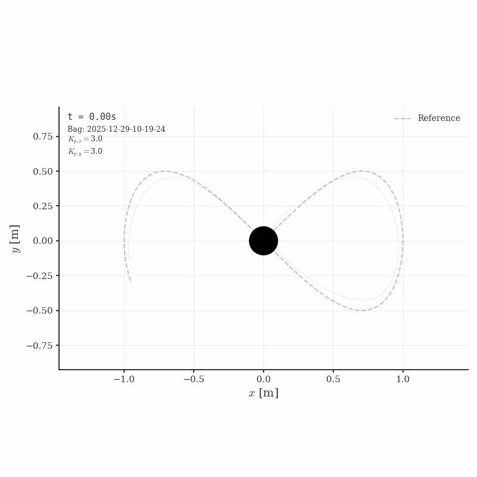
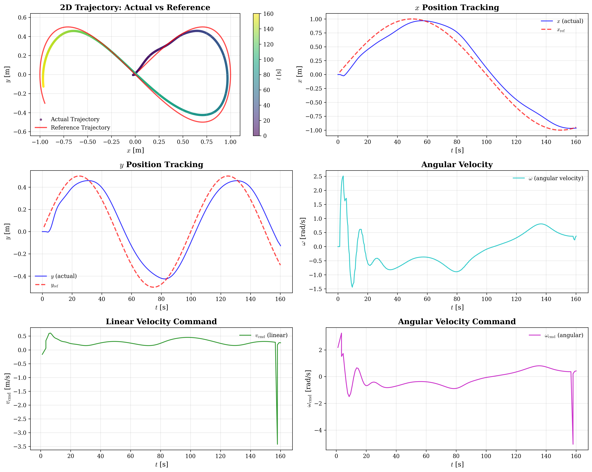

# Mobile Robots - Build & Run Commands

_Simualtion of a Unicycle model following a 8 shaped trajectory w. PID controller and a timing law._

## Start Docker Container

```bash
docker compose up -d
```

## Build Workspace

```bash
docker exec ros-noetic-workspace bash -c "cd /workspace && source /opt/ros/noetic/setup.bash && catkin_make"
```

## Run Nodes

### Terminal 1 - Start Simulator

```bash
docker exec ros-noetic-workspace bash -c "source /workspace/devel/setup.bash && roslaunch turtlebot_simulator simulator.launch"
```

### Terminal 2 - Start Trajectory Controller

```bash
docker exec ros-noetic-workspace bash -c "source /workspace/devel/setup.bash && roslaunch turtlebot_traj_ctrl trajectory_controller.launch"
```

## Interactive Shell (Optional)

```bash
docker exec -it ros-noetic-workspace bash
source /workspace/devel/setup.bash
```

## Plot Simulation Results

After running the simulation, plot the recorded data:

```bash
python3 plot_rosbag.py --latest
```

See [PLOTTING_GUIDE.md](PLOTTING_GUIDE.md) for detailed plotting instructions.

## Simulation Results

### Trajectory Animation



The animation shows the robot (black circle) following the reference trajectory in real-time.

### Detailed Plots



The plots show:
- 2D trajectory tracking (actual vs reference)
- X and Y position tracking over time
- Angular velocity
- Linear and angular velocity commands

## Stop Container

```bash
docker compose down
```
