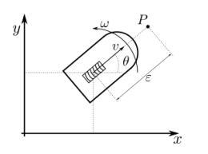

# Abstract
Small setup for simulating and tuning a unicycle model. Project offers two ROS1 packages, one for simulating the system responding to step responses and one for simulating the system following a trajectory using a PI controller.

The simulator runs as a separate node and is computes the following extended unicycle model kinematics. 

  

 
$$
\begin{cases}
\dot{x} = v \cos(\theta) \\
\dot{y} = v \sin(\theta) \\
\dot{\theta} = \omega
\end{cases}
$$

where:

$$v(s) = \frac{1}{1 + sT_v} v_{cmd}(s)$$

$$\omega(s) = \frac{1}{1 + sT_a} \omega_{cmd}(s)$$

The controller node is using the following trajectory aontrol law 

$$
\begin{align}
x_d &= a \sin\left(\frac{2\pi}{T}t\right) \\
y_d &= a \sin\left(\frac{2\pi}{T}t\right) \cos\left(\frac{2\pi}{T}t\right) \\
\dot{x}_d &= a \frac{2\pi}{T} \cos\left(\frac{2\pi}{T}t\right) \\
\dot{y}_d &= a \frac{2\pi}{T} \cos\left(\frac{4\pi}{T}t\right)
\end{align}
$$

**Control point:**
$$
\begin{align}
x_p &= x + \epsilon \cos(\theta) \\
y_p &= y + \epsilon \sin(\theta)
\end{align}
$$

**Tracking errors:**
$$
\begin{align}
e_x &= x_d - x_p \\
e_y &= y_d - y_p
\end{align}
$$

**PI control law (continuous time):**
$$
\begin{align}
v_{x_p} &= \dot{x}_d + K_{p,x} \left(e_x + \frac{1}{T_x}\int_0^t e_x \, d\tau\right) \\
v_{y_p} &= \dot{y}_d + K_{p,y} \left(e_y + \frac{1}{T_y}\int_0^t e_y \, d\tau\right)
\end{align}
$$

**Transformation to robot frame:**
$$
\begin{align}
v &= v_{x_p} \cos(\theta) + v_{y_p} \sin(\theta) \\
\omega &= \frac{v_{y_p} \cos(\theta) - v_{x_p} \sin(\theta)}{\epsilon}
\end{align}
$$

where the integrals are subject to anti-windup constraints.
## Controller Tuning Parameters

#### Tuning methodology
These control parameters where determined in two steps, first by following Ziegler-Nichols seperatly in x and y direction, and secondly by refining the parameters through simulation based refinement adjustment to adjust for coupling effects due to the heading angle $\theta$. 

By running experiments using the '''turtle_simualtor''' ROS package, we used the *test_node* to determine the critical proportional gain $K_{pk}$ and critical settling time $T_{k}$ for each axis. This was achieved by feeding a step input until the system responded in standing waves. 

The sampling time $T_{s}$ was initially sat by sampling twice as fast as the highest natural frequency component of the system, according to Nyquist-Shannon theorem. Note that the sample period used in the integral action of our controller and the sampling period of our controller i sat to be equivalent.$$T_{s} > 1 / (2 * f_{max})$$
### Results

Performing the experiments i standing waves in the x directions where found at the critical gain of $K_{pk_{x}} = 3$ and $T_{ix} = 0.8$, and similar results in y-direction $K_{pk_{y}} = 3$ and $T_{iy} = 0.8$. Follwing the caluclations of Zieger-Nichols we obtain the following results in Table 1.

| Parameter                       | Symbol     | Value        |
| ------------------------------- | ---------- | ------------ |
| Proportional gain (x-axis)      | $K_{Px}$   | $0.5K_{pk}=$ |
| Proportional gain (y-axis)      | $K_{Py}$   | $0.8=T_{k}$  |
| Integral time constant (x-axis) | $T_{Ix}$   |              |
| Integral time constant (y-axis) | $T_{Iy}$   |              |
| Sampling time                   | $T_s$      |              |
| Crossover frequency             | $\omega_c$ |              |
| Phase margin                    | PM         |              |
| Gain margin                     | GM         |              |
*Table 1: Initial controller parameters obtained from control theory design*

After implementing these results, we can see that we slightly overshoot in the entry of the corners. By adjusting the integral gain similarly for x and y, we achieving slightly better results according to the reduction in $RSME$. This leaves us with a set of refined variables found in *Table 2.* 

| Parameter | Symbol | Value |
|-----------|--------|-------|
| Proportional gain (x-axis) | $K_{Px}$ | |
| Proportional gain (y-axis) | $K_{Py}$ | |
| Integral time constant (x-axis) | $T_{Ix}$ | |
| Integral time constant (y-axis) | $T_{Iy}$ | |
| Sampling time | $T_s$ | |

*Table 2: Final controller parameters after simulation-based refinement*
## Trajectory Tracking Performance Results
We now proceed to test our controller on a eight shaped refference track determined by these equations, where i $a = 0.3$ and $T = 0.1$.

$$x = a \sin\left(\frac{2\pi}{T}t\right)$$

$$y = a \sin\left(\frac{2\pi}{T}t\right) \cos\left(\frac{2\pi}{T}t\right)$$
We run the simulation for a total time of 10 seconds, and achieve these results. 

| Performance Metric                   | Symbol             | Value |
| ------------------------------------ | ------------------ | ----- |
| Maximum tracking error (x-direction) | $e_{x,\max}$       |       |
| Maximum tracking error (y-direction) | $e_{y,\max}$       |       |
| RMS tracking error (x-direction)     | $e_{x,\text{RMS}}$ |       |
| RMS tracking error (y-direction)     | $e_{y,\text{RMS}}$ |       |
| Steady-state error (x-direction)     | $e_{x,ss}$         |       |
| Steady-state error (y-direction)     | $e_{y,ss}$         |       |
| Maximum velocity command             | $v_{\max}$         |       |
| Maximum steering command             | $\omega_{\max}$    |       |

*Table 3: Trajectory tracking performance metrics with extended unicycle kinematic model*

A figure showing the reference track and the simulated trajectory, helps us understand the behavior better.

*Figure 1: Reference track and the simulated trajectory

*Figure 2: x and y components of the tracking error;

*Figure 3: Control signals velocity ( $v_{cmd} )$ and steering ( $\omega_{cmd}$ )

 Keeping in mind our tuning requirement, the maximum tracking errors for x and y are acceptable at (), *Table 3*.

---

## Model Parameters and Implementation Details

I was assigned the following parameters for the Kinematic Unicycle model.

| Parameter                   | Symbol | Value |
| --------------------------- | ------ | ----- |
| Extended unicycle parameter | $a$    | $6.0$ |
| Time constant               | $T$    | $6.5$ |
| Actuator time constant      | $T_a$  |$0.060$|
|                             |        |       |

*Table 4: Extended unicycle model parameters*

The project contains the following ROS- nodes and packages:
****** 

| Filename                       | Descrition                                                                                                             |
| ------------------------------ | ---------------------------------------------------------------------------------------------------------------------- |
| `simulator.launch`             | Launch file for starting `turtlebot_simulator` and `test_node` and  nodes                                              |
| `trajectory_controller.launch` | Launch file for starting the `turtlebot_simulator` and `trajectory_controller`nodes                                    |
| `plot_rosbag.py`               | Produces a plot containing all plots used in this report, as well as a animation of the robots xy positions over time. |
*Note, both lauch files also starts the*``rosbag_recorderrosbag_recorder``*used for recording messages published on the ROS topics

# How to
The project is done using a docker container for running ROS1. Container is started using a *docker-compose.yaml* file. Here are some instructions for how to reproduce the results.

