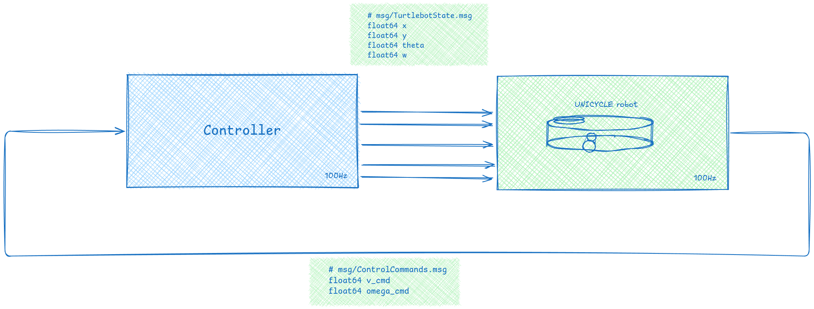
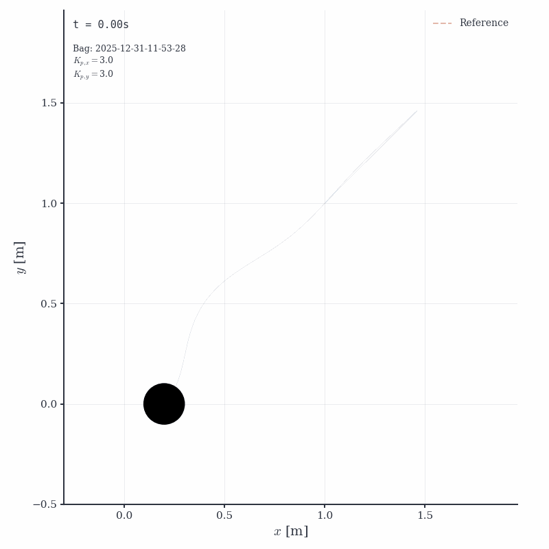
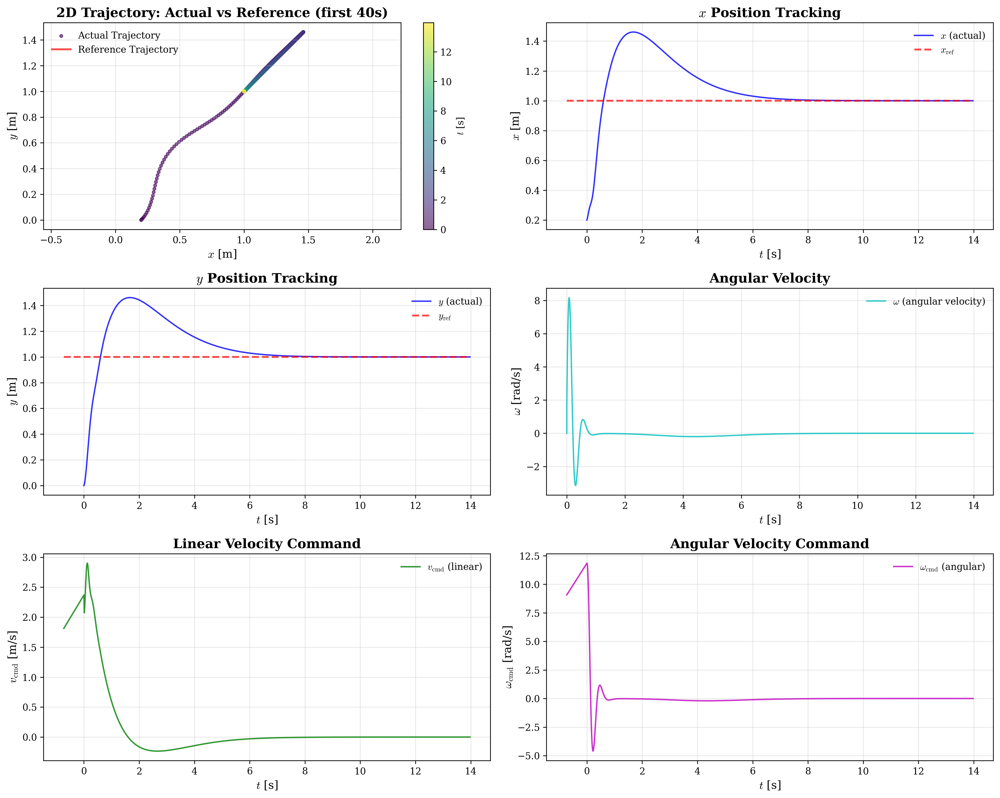

# Control of Mobile Robots, Report
*H25, Bailin Balinov, Polimi*
## Abstract
Small setup for simulating and tuning a unicycle model. Project offers two ROS1 packages, one for simulating the system responding to step responses and one for simulating the system following a trajectory using a PI controller.

The simulator runs as a separate node and is computes the following extended unicycle model kinematics. 

  

 
$$
\begin{cases}
\dot{x} = v \cos(\theta) \\
\dot{y} = v \sin(\theta) \\
\dot{\theta} = \omega
\end{cases}
$$

where:

$$v(s) = \frac{1}{1 + sT_a} v_{cmd}(s)$$

$$\omega(s) = \frac{1}{1 + sT_a} \omega_{cmd}(s)$$

The controller node is using the following trajectory aontrol law 

## Simulator
Simulator implements the extended unicycle model, and uses a Rünge-Kutta 4 for the integration scheme. The controller sampling frequency was selected based on the Nyquist–Shannon sampling theorem and standard digital control practice, choosing a rate 15 times greater than the system bandwidth derived from the actuator time constants. The numerical integration step size was chosen an order of magnitude smaller than the controller sampling period to ensure accurate resolution of the fastest dynamics and numerical stability of the RK4 method.

  

$$fb​≈2πT_{a}​=2π(0.06)1​≈2.65Hz$$
$$fc​≥10×2.65≈26.5Hz$$

where the integrals are subject to anti-windup constraints.

## Controller Tuning Parameters

A twostep approach was followed approach was used for tuning the controller, first by classical poleplacement of the 2nd order error dynamics, followed by manually adjusting the hyperparameters of the controller with respect to results obtained by our closed loop simulator. In the initial analysis we treat the dynamics in x and y as decoupled.

### Controller requirement's

$$x = a \sin\left(\frac{2\pi}{T}t\right)$$

$$y = a \sin\left(\frac{2\pi}{T}t\right) \cos\left(\frac{2\pi}{T}t\right)$$

$$
\begin{equation}
\omega_{traj} = \frac{4\pi}{T} = \frac{4\pi}{6.5} = 1.93 \text{ rad/s}
\end{equation}
$$

$$
\begin{equation}
\omega_{act} = \frac{1}{T_a} = \frac{1}{0.060} = 16.67 \text{ rad/s}
\end{equation}
$$

Required controller bandwidth:

$$
\begin{equation}
\omega_n \in [5\omega_{traj}, \, \omega_{act}/3] = [9.65, \, 5.56] \text{ rad/s}
\end{equation}
$$

Since the ranges don't overlap, we choose to respect the actuator limit:

$$
\begin{equation}
\omega_n = \frac{\omega_{act}}{3} = \frac{16.67}{3} = 5.56 \text{ rad/s}
\end{equation}
$$
##### Select Damping Ratio

For trajectory tracking without overshoot:
$$
\begin{equation}
\zeta = 1.0 \quad \text{(critically damped)}
\end{equation}
$$  

Step 3: Calculate Controller Gains
$$ 
\begin{equation}
s^2 + K_p s + K_i = 0
\end{equation}
$$

$$
\begin{equation}
s^2 + 2\zeta\omega_n s + \omega_n^2 = 0:
\end{equation}
$$

$$
\begin{align}
K_p &= 2\zeta\omega_n = 2(1.0)(5.56) = \boxed{11.1} \\
K_i &= \omega_n^2 = (5.56)^2 = \boxed{30.9}
\end{align}
$$

| Parameter                   | Symbol | Value |
| --------------------------- | ------ | ----- |
| Extended unicycle parameter | $a$    | $6.0$ |
| Time constant               | $T$    | $6.5$ |
| Actuator time constant      | $T_a$  |$0.060$|
|                             |        |       |

*Table 1: Extended unicycle model parameters*

- Comments on zero steady state error, disturbance rejection
- Cross over frequency
- Actuator limits

for both tuning steps, explaining the procedures you have followed to determine the controller requirements
(crossover frequency, zero steady-state error, disturbance rejection, actuator 'effort limitation, etc.), and to
tune the controller.

The sampling time $T_{s}$ was initially sat by sampling twice as fast as the highest natural frequency component of the system, according to Nyquist-Shannon theorem. Note that the sample period used in the integral action of our controller and the sampling period of our controller i sat to be equivalent.$$T_{s} > 1 / (2 * f_{max})$$

### Tuning by poleplacement

| Parameter                       | Symbol     | Value        |
| ------------------------------- | ---------- | ------------ |
| Proportional gain (x-axis)      | $K_{Px}$   | $0.5K_{pk}=$ |
| Proportional gain (y-axis)      | $K_{Py}$   | $0.8=T_{k}$  |
| Integral time constant (x-axis) | $T_{Ix}$   |              |
| Integral time constant (y-axis) | $T_{Iy}$   |              |
| Sampling time                   | $T_s$      |               |
| Crossover frequency             | $\omega_c$ |              |
| Phase margin                    | PM         |              |
| Gain margin                     | GM         |              |
*Table 1: Initial controller parameters obtained from control theory design*

### Refinement through simulation

To take into account the coupling effects due to the transformation to the robot frame, and to observe the effects of the actuator lag $T_{a}$ we perform a siumulation of our controll policy by running the l

  

*Figure 1: Reference track and the simulated trajectory

*Figure 2: x and y components of the tracking error;

*Figure 3: Control signals velocity ( $v_{cmd} )$ and steering ( $\omega_{cmd}$ )

- Keeping in mind our tuning requirement, the maximum tracking errors for x and y are acceptable at (), *Table 3*. Discussion.

  

*Table 2.* 

| Parameter | Symbol | Value |
|-----------|--------|-------|
| Proportional gain (x-axis) | $K_{Px}$ | |
| Proportional gain (y-axis) | $K_{Py}$ | |
| Integral time constant (x-axis) | $T_{Ix}$ | |
| Integral time constant (y-axis) | $T_{Iy}$ | |
| Sampling time | $T_s$ | |

| Performance Metric                   | Symbol             | Value |
| ------------------------------------ | ------------------ | ----- |
| Maximum tracking error (x-direction) | $e_{x,\max}$       |       |
| Maximum tracking error (y-direction) | $e_{y,\max}$       |       |

*Table 2: Final controller parameters after simulation-based refinement*

---

## Model Parameters and Implementation Details

The project contains the following ROS- nodes and packages:
****** 

| Filename                       | Descrition                                                                                                             |
| ------------------------------ | ---------------------------------------------------------------------------------------------------------------------- |
| `simulator.launch`             | Launch file for starting `turtlebot_simulator` and `test_node` and  nodes                                              |
| `trajectory_controller.launch` | Launch file for starting the `turtlebot_simulator` and `trajectory_controller`nodes                                    |
| `plot_rosbag.py`               | Produces a plot containing all plots used in this report, as well as a animation of the robots xy positions over time. |
*Note, both lauch files also starts the*``rosbag_recorderrosbag_recorder``*used for recording messages published on the ROS topics
